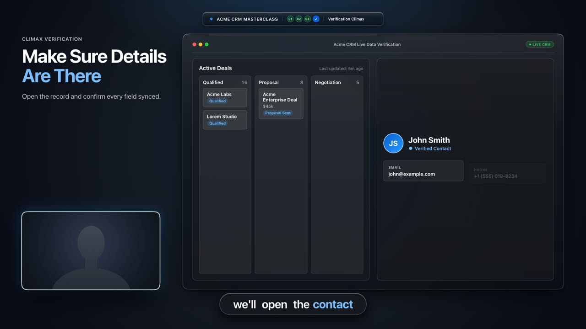
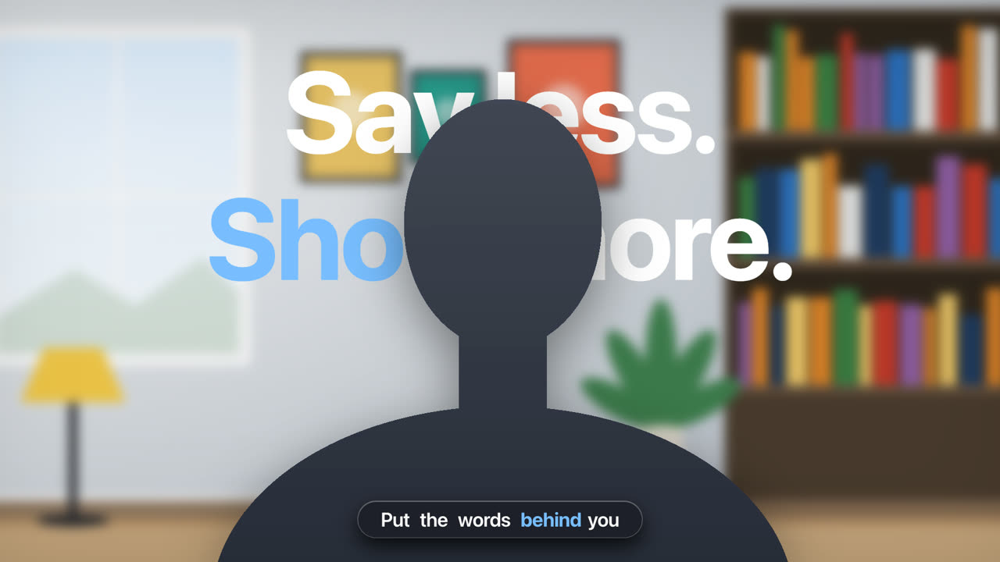
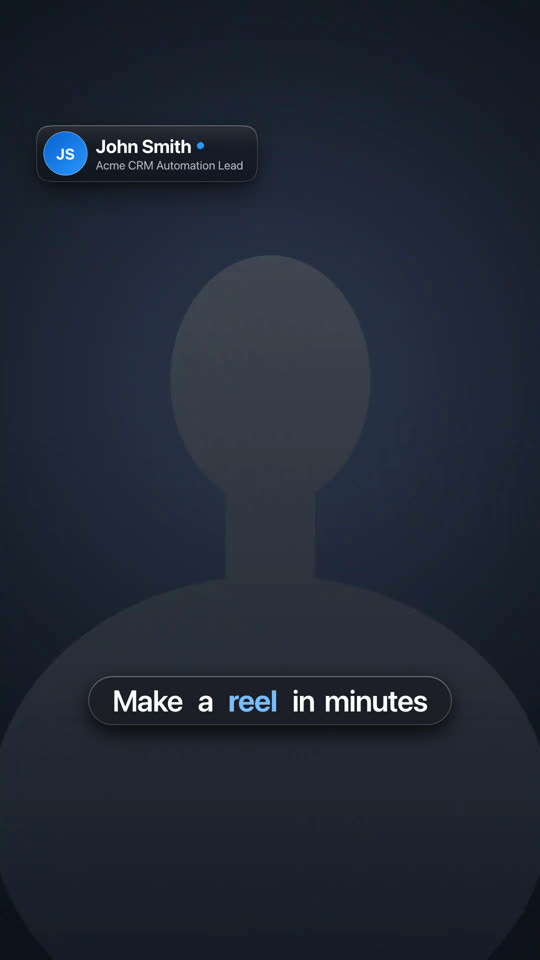

# Apple Video Kit

**Make polished tutorial videos by writing a few lines of settings, not by dragging clips around a timeline.**

<p>
  
  
</p>
<sub>Both frames come from the demos that ship with the kit. The speaker is a faceless placeholder.</sub>

## What is this?

You record yourself, and usually your screen. This kit turns that footage into a clean, professional video with smooth zooms, captions, titles, cards and transitions, all in an Apple-style look (soft glass, rounded corners, gentle spring motion).

You do not edit by hand. You describe the video in a short settings file, for example "at 3 seconds zoom into the form" or "at 9 seconds put a ring around the Submit button", and the kit does the motion. It is free, it runs on your own computer, and nothing is uploaded.

It is built on [HyperFrames](https://hyperframes.heygen.com), a tool that turns web pages into video files. You do not need to know how that works.

> Not affiliated with Apple Inc. "Apple-style" only describes the look. No Apple assets are included: the icons are original and the fonts are your computer's own.

## Pick your kind of video

| | Screen share | Talking head | Speaker cutout | Short-form reel |
|---|---|---|---|---|
| **Use it when** | You show an app or a website and talk over it | You talk to the camera and sometimes show something | You want to look like you are in an office or studio, or put big text behind your head | You make vertical videos for Reels, TikTok or Shorts |
| **What you get** | Your screen floats on a wallpaper and zooms to what you talk about; your webcam sits in a small card that tucks away when the screen zooms | Glass cards, lower-thirds, captions and a small picture of you that moves out of the way of your face | A new room behind you, a title behind your head, your mic still in front of you | A vertical 1080x1920 frame with captions and cards kept out of the phone's buttons and caption bar, and off your face |
| **You edit** | `projects/screen-share/share.js` | `components/camera.js` and `index.html` | `projects/speaker-cutout/cutout.js` | `projects/short-form/index.html` |
| **Try the demo** | `npm run share:dev` | `npm run dev` | `npm run speaker:dev` | `npm run short:dev` |



The **short-form reel** mode is 9:16 (1080x1920). Captions and cards stay out of the top 230 px, the bottom 430 px and the right 150 px, where the phone's interface covers the picture, and `npm run reel` fails a caption that flashes by too fast to read or whose colours are hard to read. You choose the caption colours, and captions can build up word by word as you speak. The playbook is in `.agents/skills/apple-video-editor/references/short-form.md`.

## What is in the box

- **19 ready-made blocks** you place by time: info cards, an app window, a contact card, a checklist, a quote, a before/after slider, keyboard shortcut keys, a "link in the description" chip, a fast-forward badge, a lower-third, captions, a chapter pill, an intro or end card, a title that sits behind your head, an iMessage phone, and a transition pack (fade, flash, blur, glass wipe, iris, light sweep, chapter break).
- **Screen-share moves:** zooms with a slow drift, callout rings, "look here" dimming, blur boxes for private info (emails, keys, client names), your webcam going full screen or hiding, and a small punch-in at every cut.
- **Tools** to prepare and finish: cut pauses, clean up a CapCut transcript, colour grade, frame-by-frame review (see [The tools](#the-tools)).
- **A library page** where you browse every block and animation, play it, change its text and copy the code. It also has a storyboard to plan a video and a frame-by-frame review page.
- **Checks** that catch mistakes before you render: text unreadable, a card covering your face, a missing audio track, private data in a commit.

## Quick start

You need [Node.js 22+](https://nodejs.org) and [ffmpeg](https://ffmpeg.org). The face and cutout tools also need Python 3.9+; they install what they need by themselves the first time.

```bash
npx github:csalamida/apple-video-kit init my-video
cd my-video
npm install
npm run library
```

Open <http://localhost:4173/library/>. You will see every block, with a Play button and editable text. The **Animations** page shows every move, and the **QA** page is the frame-by-frame reviewer.

Then try a demo:

```bash
npm run share:dev      # screen share
npm run dev            # talking head
npm run speaker:dev    # speaker cutout
npm run short:dev      # vertical reel
```

The demos need no footage. On first run the kit makes a faceless placeholder speaker and a test-pattern screen for you.

Prefer to clone? `git clone https://github.com/csalamida/apple-video-kit.git`, then `npm install`.

## Make your own video

1. **Put your footage in `inputs/`.** That folder is never uploaded or committed, so your face and voice stay on your computer.
2. **Point the page at your files.** Screen share: set `#screen` (your screen recording, no sound) and `#cam` (your webcam, with your voice) in `projects/screen-share/index.html`. Talking head: set `#footage` in `index.html`.
3. **Describe the video.** Open the settings file for your kind of video (table above). Each line is a moment: a time, and what should happen. The library page shows the exact line for every block and move, so you can copy and paste.
4. **Check it.** `npm run check:all` runs every check and tells you in plain words what is wrong.
5. **Render.** `npm run share:render`, `npm run render`, `npm run speaker:render` or `npm run short:render` writes an MP4 into `renders/`.
6. **Review the render.** `npm run qa -- renders/<file>.mp4` then open the QA page and step through it.

Not sure where to start? Ask an AI editor (next section) and say what kind of video you want.

## The tools

Every tool is one command. Inputs and results live in `inputs/`.

**Prepare**

| Command | What it does |
|---|---|
| `npm run trim -- inputs/webcam.mp4 --also inputs/screen.mp4` | Cuts the pauses and keeps screen and webcam in sync. Prints the clips and the jump-cut times. |
| `npm run face -- inputs/me.mp4` | Finds your face once, so cards know to stay off it. |
| `npm run cutout -- inputs/me.mp4 --from 10 --to 25` | Makes a transparent video of you for the cutout mode. Slow (about 1 frame per second), so only do the stretches that need it. Optional light wrap (`--plate`), `--erase` for leftovers like a chair back, `--scale 0.5` to go faster. |
| `npm run backdrop -- inputs/me.mp4 --scene office` | Measures your camera angle and light and writes the prompt for an image generator, so the room it makes matches you. Scenes: office, studio, living-room, cafe, library, conference-room. |
| `npm run plate -- inputs/room-with-me.png` | If your generated image has you in it, this removes you and gives a clean room. |
| `npm run prop -- inputs/me.mp4 --box x,y,w,h --name mic --keep dark` | Cuts something in front of you (a mic, a mug) so it stays in front of you after the cutout. |

**Plan**

| Command | What it does |
|---|---|
| `npm run polish -- inputs/capcut.srt --audio inputs/export.mp4` | Cleans up a CapCut transcript: fixes names and punctuation, collapses repeats, finds filler words, makes clean captions and word timings, and writes a report of every change. |
| `npm run plan -- inputs/transcript.srt --mode screen` | Reads a transcript and suggests what to add where (zooms, callouts, blurs, cards). It flags emails and keys it hears. |

**Finish**

| Command | What it does |
|---|---|
| `npm run grade -- inputs/me.mp4` | Fixes white balance and exposure from your face, then applies a look. A skin-tone guard refuses any grade that makes skin look wrong. Speaker only, never screen recordings. |
| `npm run qa -- renders/video.mp4 --page index.html` | Reviews the finished file: size, length, sound, black frames, frozen stretches, flashing, loudness. Saves every frame for the QA page. It never approves a video; you do. |

**Check**

`npm run check:all` runs everything. The individual ones are `check` (talking head), `share:check`, `speaker:check`, `short:check` (vertical reel), `reel` (captions hold long enough, nothing inside the phone's buttons, letters never clipped), `check:face` (nothing covers your face) and `check:privacy` (nothing private is about to be committed).

## Working with an AI editor

The kit includes instructions for AI coding assistants (Claude Code, Codex and others): `CLAUDE.md`, `AGENTS.md` and a skill in `.agents/skills/apple-video-editor/`. They hold the house rules (design, timing, what each block is for) and step-by-step playbooks for the speaker cutout and for finishing a video.

A good way to work: send your CapCut transcript, say what kind of video it is, and ask for a first draft. The assistant polishes the transcript, drafts the cue plan, writes the settings, runs the checks and shows you frames. If you want a new background it will ask what place you want, give you the prompt, and wait for your image.

## Keeping it up to date

```bash
npx github:csalamida/apple-video-kit update --dry-run   # see what would change
npx github:csalamida/apple-video-kit update
npm install
```

The update replaces the kit's own files and never touches yours: `inputs/`, `index.html`, `components/camera.js`, everything in `projects/` (your settings files) and your privacy list. If you edited a kit file, your version is saved to `.kit/backup/` first and the update tells you which files.

## Privacy

- Everything that shows you or holds your voice (footage, cutouts, face data, transcripts, reference frames) stays in `inputs/`, `renders/` and `qa/`. All three are ignored by git.
- `npm run check:privacy` blocks videos, photos, large files and any name on your own private list. To use the list, put one name per line in a file called `.privacy-denylist` (git ignores it). To run the check before every commit:

```bash
printf '#!/bin/sh\nnode scripts/check-privacy.mjs || exit 1\n' > .git/hooks/pre-commit && chmod +x .git/hooks/pre-commit
```

- Nothing is uploaded. The background removal and the transcriber run on your computer. If you use an image generator for rooms, that is your own tool and your own choice.
- The demos use a faceless placeholder and made-up names (John Smith, Jane Doe, Acme).

## If something goes wrong

- **`ffmpeg not found`**: install it (macOS: `brew install ffmpeg`, Windows: `winget install ffmpeg`).
- **A check fails**: read its message; it names the file and the time. Fix that and run `npm run check:all` again.
- **The cutout takes forever**: it matches about 1 frame per second. Use `--from` and `--to` for only the parts that need it, and try `--scale 0.5`.
- **A piece of your chair is left beside your neck**: use `--erase "x,y,w,h"` on that spot, or record without the chair in frame. The cutout playbook explains how to find the coordinates.
- **Your mic disappeared after the cutout**: that is expected (the model keeps people only). Bring it back with `npm run prop`.
- **The library page is blank**: it needs to be served. Use `npm run library`, not a double-click on the file.

More detail is in `.agents/skills/apple-video-editor/` (`SKILL.md` and the two playbooks in `references/`).

## Licence

MIT. See `LICENSE`.
